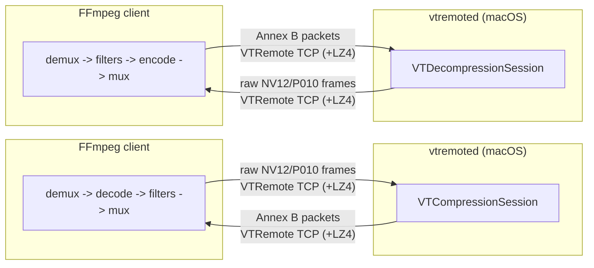

# VideoToolbox Remote

Use a **Mac (ideally Apple Silicon)** as a hardware H.264 / HEVC encoder/decoder “helper” for FFmpeg running on another machine.

This project offloads **VideoToolbox encode/decode** to a **macOS daemon** while keeping the rest of the FFmpeg pipeline (demux, filters, audio/subs, mux) on the client. 

---

## Who is this for?

This is useful if:

- You run FFmpeg on **Linux/Windows** (or a machine without Apple’s hardware codecs),
- You have a **Mac on the same LAN** you can keep running as a helper,
- You care about **speed** (hardware encode/decode) more than absolute best compression efficiency.

This is *not* a good fit if:

- You only have Wi‑Fi / slow LAN (raw video frames are large),
- You need encryption on the wire (see **Security** below),
- You want a plug-and-play solution with prebuilt binaries (this repo is source-first).

---

## How it works (mental model)



Wire compression (LZ4) is enabled by default to reduce bandwidth. 

---

## Components (repo layout)

- `vtremoted/` — macOS daemon (VideoToolbox encode/decode over TCP)
- `ffmpeg/` — FFmpeg fork with remote codecs:
  - `h264_videotoolbox_remote`
  - `hevc_videotoolbox_remote`
  - plus matching decoders
- `docs/` — protocol + architecture docs 

---

## Quickstart

### 1) macOS server: build + run `vtremoted`

On the Mac:

```bash
brew install lz4 pkg-config
cd vtremoted
swift build -c release
```

Run it in the foreground (good for first-time setup):

```bash
.build/release/vtremoted --listen 0.0.0.0:5555 --log-level 1
```

Or install as a launchd service (recommended for “always on” setups):

```bash
./install_launchd.sh --bin /usr/local/bin/vtremoted --listen 0.0.0.0:5555
```

(Port `5555` is just an example; pick what you want.)

**Make sure macOS firewall allows inbound connections** to the daemon’s port.

---

### 2) FFmpeg client: build the included FFmpeg fork

On your client machine (Linux/Windows/macOS), build the `ffmpeg/` fork in this repo.

Install dependencies:

* You need **liblz4 + pkg-config** available on the build system.

Configure FFmpeg with the remote codecs:

```bash
cd ffmpeg

./configure ... --enable-liblz4 \
  --enable-videotoolbox-remote

make -j
```

---

### 3) Encode remotely

Example: encode video using the Mac’s VideoToolbox engine, but keep audio/subs untouched:

```bash
ffmpeg -i input.mkv \
  -c:v h264_videotoolbox_remote -vt_remote_host macmini.local:5555 \
  -b:v 6000k -g 240 \
  -c:a copy -c:s copy \
  output.mkv
```

---

## Common options you’ll care about

### Remote host

Point the codec at your Mac:

* `-vt_remote_host host:port`

### Wire compression

Enabled by default (LZ4). To disable:

* `-vt_remote_wire_compression none`

### Token authentication (recommended on shared networks)

* Client: `-vt_remote_token YOUR_TOKEN`
* Server: `--token YOUR_TOKEN`

---

## Performance notes

Remote VideoToolbox means you are sending/receiving video frames over the network.
For high resolutions / high FPS, a **wired LAN** is strongly recommended.

If performance is poor:

* Try enabling/keeping LZ4 wire compression (default),
* Avoid heavy filters on the client side if you’re CPU limited,
* Prefer a faster network link (2.5GbE/10GbE if you’re doing 4K).

---

## Security

Traffic is over TCP and token auth is optional. Token auth is **not encryption**.

If you need a safer setup:

* Bind the daemon to localhost on the Mac, and use an **SSH tunnel** or VPN
* Do **not** expose the daemon port directly to the public internet

See `docs/security.md` for suggested hardened setups.

---

## Troubleshooting

Start here:

* `docs/troubleshooting.md`

Quick checks:

* Can you reach the Mac’s host/port from the client?
* Is macOS firewall blocking it?
* Do client/server tokens match?
* Run server with a higher log level to see connection/auth/protocol errors:
  `--log-level 1`

---

## License

This project follows FFmpeg-style licensing (LGPL v2.1+ with optional GPL parts). See `LICENSE.md` / `COPYING.*` and `ffmpeg/LICENSE.md`.
