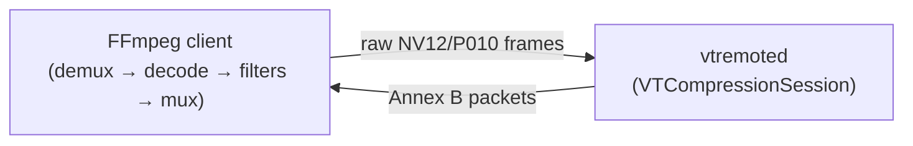
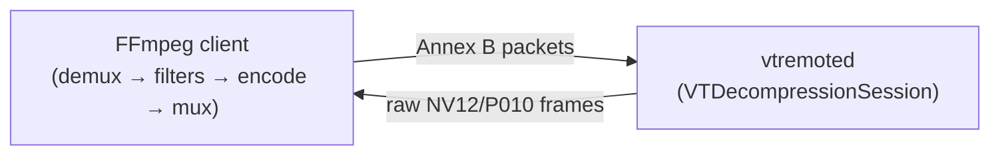
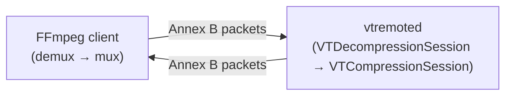

# VideoToolbox Remote

Use an Apple Silicon based Mac as a hardware H.264 / HEVC encoder/decoder “helper” for FFmpeg running on another machine.

This project offloads **VideoToolbox encode/decode** to a **macOS daemon** while keeping the rest of the FFmpeg pipeline (demux, filters, audio/subs, mux) on the client. 

---
## Quickstart

```bash
#clone repo
git clone https://github.com/davelindo/videotoolbox_remote.git
cd videotoolbox_remote
#build (macOS server + local ffmpeg)
make build
sudo make install

#run server on the Mac
vtremoted --listen 0.0.0.0:5555 --log-level 1

#encode from client
ffmpeg -i input.mkv \
  -c:v h264_videotoolbox_remote -vt_remote_host macmini.local:5555 \
  -b:v 6000k -g 240 \
  -c:a copy -c:s copy \
  output.mkv

#transcode from client (packet in/out, explicit)
ffmpeg -i input.mkv \
  -c:v hevc_videotoolbox -vt_remote_transcode -vt_remote_host macmini.local:5555 \
  -b:v 6000k -g 240 \
  -c:a copy -c:s copy \
  output.mkv
```

If you're building the client on Linux/Windows, configure FFmpeg with
`--enable-videotoolbox-remote --enable-liblz4 --enable-libzstd`.

## Who is this for?

This is useful if:

- You run FFmpeg on **Linux/Windows** (or a machine without Apple’s hardware codecs),
- You have a **Mac on the same LAN** you can keep running as a helper,
- You care about **speed and efficiency** (hardware encode/decode) more than absolute best compression efficiency.

This is *not* a good fit if:

- You only have **very slow or unstable** LAN/Wi‑Fi (1080p60 encode needs ~71–107 Mb/s in, and 4K60 decode can push ~555 Mb/s),
- You need encryption on the wire (see **Security** below),
- You do not have a good grasp of FFmpeg.

---

## Modes (explicit)

- Remote encode: use `h264_videotoolbox_remote` / `hevc_videotoolbox_remote` with `-vt_remote_host`.
- Remote decode: use `h264_videotoolbox_remote` / `hevc_videotoolbox_remote` as the decoder.
- Remote transcode (packet in/out): add `-vt_remote_transcode` to a standard VideoToolbox encode command. Requires H.264/HEVC input and no filters.

Note: `-vt_remote_host` does not change local `*_videotoolbox` behavior by itself. You must explicitly choose the remote codec or `-vt_remote_transcode`.

## Choosing a mode (decision matrix)

Use this as a quick guide for tradeoffs and expected behavior.

| Scenario | Recommended | Why | Notes |
|---|---|---|---|
| Weak client CPU | **Transcode** | Keeps compressed packets on the wire and offloads decode+encode | Requires H.264/HEVC input and no filters |
| Fast LAN, want simplicity | **Remote encode** | Straightforward, uses full FFmpeg pipeline locally | Raw-frame transport uses more bandwidth |
| Need filters/scale on client | **Remote encode** | Filters require raw frames locally | Use `-vt_remote_wire_compression lz4` on faster links |
| Need decode-only (playback or testing) | **Remote decode** | Offloads decode without re-encode | Raw frames sent back to client |
| Low bandwidth link | **Transcode** | Packet-in/out minimizes wire usage | Throughput may be lower than encode-only |
| Want maximum throughput and can run on Mac | **Run ffmpeg on Mac** | Avoids raw-frame transport entirely | Mount media (SMB/AFP/NFS) or SSH in and run locally |

Remote mounting option: if you can mount storage on the Mac (SMB/AFP/NFS) and run ffmpeg there, you get local VideoToolbox performance with no raw‑frame network cost. This is the best‑throughput option, but it shifts the full pipeline to the Mac.

## How it works (mental model)

Pick one of the three modes below. Each uses a single TCP session to the macOS server.

### Remote encode (raw frames → packets)

Client does decode/filters; server does encode.


```mermaid
flowchart LR
  Client["FFmpeg client\n(demux → decode → filters → mux)"]
  Server["vtremoted\n(VTCompressionSession)"]
  Client -- "raw NV12/P010 frames" --> Server
  Server -- "Annex B packets" --> Client
```

### Remote decode (packets → raw frames)

Client does encode; server does decode.


```mermaid
flowchart LR
  Client["FFmpeg client\n(demux → filters → encode → mux)"]
  Server["vtremoted\n(VTDecompressionSession)"]
  Client -- "Annex B packets" --> Server
  Server -- "raw NV12/P010 frames" --> Client
```

### Remote transcode (packets → packets)

Client does demux/mux only; server does decode+encode. Optional scale/format can happen on the server.


```mermaid
flowchart LR
  Client["FFmpeg client\n(demux → mux)" ]
  Server["vtremoted\n(VTDecompressionSession → VTCompressionSession)"]
  Client -- "Annex B packets" --> Server
  Server -- "Annex B packets" --> Client
```

---

## Performance notes

Remote VideoToolbox means you are sending/receiving video frames over the network for encode/decode.
Transcode mode keeps compressed packets on the wire, which reduces bandwidth and client CPU compared to raw-frame transport.
For high resolutions / high FPS, a **wired LAN** is recommended.

### Real-world snapshot (Linux client → macOS M2, 2.5GbE)

We ran the integration benchmarks on a Linux client against an Apple Silicon (M2) macOS server over a 2.5GbE LAN:

- **Remote encode vs local**: 1080p60 is near‑parity with local VideoToolbox; 4k60 drops below realtime on this link.
- **Wire compression**: `lz4` outperformed `zstd` for raw‑frame encode at 4k60; `none` under‑performed due to network saturation.
- **Transcode mode**: throughput is similar or slightly lower than encode‑only (expected, since it does decode+encode), but it keeps **compressed packets** on the wire.
- **Best use of transcode**: weak client CPUs and/or slower links where raw‑frame transport is the bottleneck.

### CPU sampling (evidence for weak‑CPU clients)

We sampled client CPU during 1080p60, 10s runs (10M, GOP 120, LZ4):

- **Remote encode (raw frames)**: ~145% client CPU
- **Remote transcode (packet in/out)**: ~6–7% client CPU

Server CPU stayed near idle because encode/decode happens in VideoToolbox hardware. This is the primary win of transcode mode on weak clients.

### Required wire bandwidth for real‑time (Zstd on)

**Headline requirement (worst case from the benchmark):**
encode needs ~395 Mb/s **upstream** (client → server) at 4K60 (HEVC P010), and
decode needs ~555 Mb/s **downstream** (server → client) at 4K60 (H.264).
Use **1 GbE minimum** and **2.5 GbE+ recommended** if you want headroom for multiple streams
or harder‑to‑compress content.

Measured from `vtremoted` session summaries using `tests/integration/bench_vtremote.sh`
(`testsrc2`, 5s, `-b:v 10M`, `-maxrate 10M`, `-bufsize 20M`, GOP 120, loopback). Values below are computed as
`bytes_on_wire / media_duration`. The summary log reports **throughput while encoding**,
which can be much higher than real‑time if the Mac encodes faster than 1×.
2K/4K rows use **DCI framing** (2048×1080 / 4096×2160).
Results below use **Zstd** compression (standard default).

#### Required bandwidth at real‑time (MAX(In, Out))

| Format | FPS | H.264 (NV12) Mb/s | HEVC (P010) Mb/s |
|---|---:|---:|---:|
| 720p | 30 | 18.2 | 19.1 |
| 720p | 60 | 39.5 | 42.1 |
| 720p | 120 | 84.2 | 88.5 |
| 1080p | 30 | 38.1 | 41.5 |
| 1080p | 60 | 79.8 | 85.3 |
| 1080p | 120 | 165.2 | 168.4 |
| 1440p | 30 | 66.4 | 66.2 |
| 1440p | 60 | 134.1 | 129.5 |
| 1440p | 120 | 297.5 | 265.8 |
| 2K (2048x1080) | 30 | 40.4 | 45.6 |
| 2K (2048x1080) | 60 | 84.2 | 93.3 |
| 2K (2048x1080) | 120 | 175.6 | 181.4 |
| 4K (4096x2160) | 60 | 377.7 | 294.9 |

*Note: Bandwidth usage is ~30-40% lower than LZ4 thanks to Zstd.*

If performance is poor:

* Avoid heavy filters on the client side if you're CPU limited,
* Prefer a faster network link (2.5GbE/10GbE if you're doing 4K).

### Performance tuning options

Server defaults (when the client doesn't override):

| Setting | Default | Effect |
|---------|---------|--------|
| `RealTime` | `false` (forced when unset) | Maximize throughput |
| `PrioritizeEncodingSpeedOverQuality` | unset | Uses VideoToolbox default unless explicitly set |
| `MaximizePowerEfficiency` | `false` (forced when unset) | Maximize speed |
| `MaxFrameDelayCount` | from `-bf` when set | Enables/limits frame reordering |
| `ExpectedFrameRate` | from client | Helps VideoToolbox optimize |

Remote decode defaults to **async** with a reorder depth of **2**. See `docs/async_decode.md` for details and overrides.

Client-side options:

```bash
# Increase in-flight frames for higher throughput (default: 16)
-vt_remote_inflight 32

# Wire compression: zstd (default), lz4, or none
-vt_remote_wire_compression zstd

# For realtime/streaming use cases (disables speed prioritization)
-realtime 1
```

Defaults by codec (remote encode):

- **H.264**: `vt_remote_wire_compression=lz4`, `vt_remote_inflight=64`
- **HEVC**: `vt_remote_wire_compression=zstd`, `vt_remote_inflight=16`

---

## Security

Traffic is over TCP and token auth is optional. Token auth is **not encryption**.

If you need a safer setup:

* Bind the daemon to localhost on the Mac, and use an **SSH tunnel** or VPN
* Do **not** expose the daemon port directly to the public internet

See `docs/security.md` for suggested hardened setups.

---

## Troubleshooting

Start here:

* `docs/troubleshooting.md`

Quick checks:

* Can you reach the Mac’s host/port from the client?
* Is macOS firewall blocking it?
* Do client/server tokens match?
* Run server with a higher log level to see connection/auth/protocol errors:
  `--log-level 1`

---

## License

This project follows FFmpeg-style licensing (LGPL v2.1+ with optional GPL parts). See `LICENSE.md` / `COPYING.*` and `ffmpeg/LICENSE.md`.
