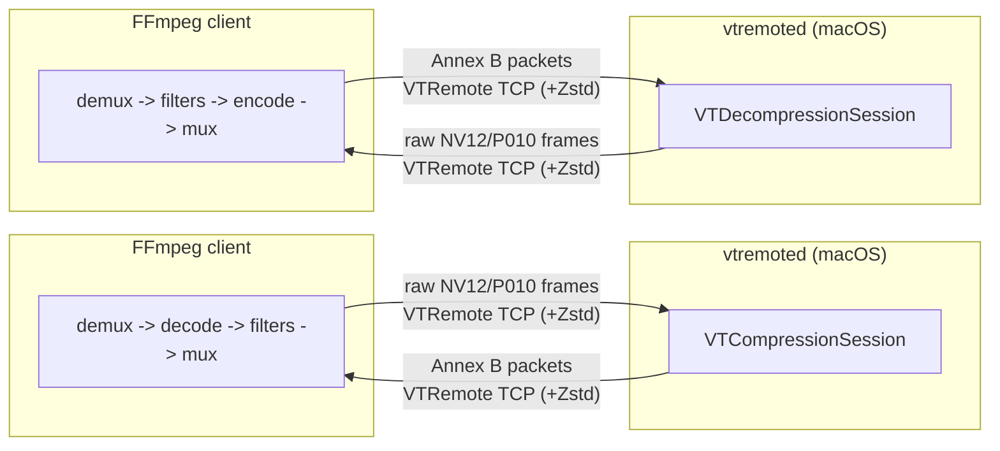

# VideoToolbox Remote

Use an Apple Silicon based Mac as a hardware H.264 / HEVC encoder/decoder “helper” for FFmpeg running on another machine.

This project offloads **VideoToolbox encode/decode** to a **macOS daemon** while keeping the rest of the FFmpeg pipeline (demux, filters, audio/subs, mux) on the client. 

---
## Quickstart

```bash
#clone repo
git clone https://github.com/davelindo/videotoolbox_remote.git
cd videotoolbox_remote
#build
make build
sudo make install
#encode
ffmpeg -i input.mkv \
  -c:v h264_videotoolbox_remote -vt_remote_host macmini.local:5555 \
  -b:v 6000k -g 240 \
  -c:a copy -c:s copy \
  output.mkv
```

## Who is this for?

This is useful if:

- You run FFmpeg on **Linux/Windows** (or a machine without Apple’s hardware codecs),
- You have a **Mac on the same LAN** you can keep running as a helper,
- You care about **speed and efficiency** (hardware encode/decode) more than absolute best compression efficiency.

This is *not* a good fit if:

- You only have **very slow or unstable** LAN/Wi‑Fi (1080p60 encode needs ~71–107 Mb/s in, and 4K60 decode can push ~555 Mb/s),
- You need encryption on the wire (see **Security** below),
- You do not have a good grasp of FFmpeg.

---

## How it works (mental model)



---

## Performance notes

Remote VideoToolbox means you are sending/receiving video frames over the network.
For high resolutions / high FPS, a **wired LAN** is recommended.

### Required wire bandwidth for real‑time (Zstd on)

**Headline requirement (worst case from the benchmark):**
encode needs ~395 Mb/s **upstream** (client → server) at 4K60 (HEVC P010), and
decode needs ~555 Mb/s **downstream** (server → client) at 4K60 (H.264).
Use **1 GbE minimum** and **2.5 GbE+ recommended** if you want headroom for multiple streams
or harder‑to‑compress content.

Measured from `vtremoted` session summaries using `tests/integration/bench_vtremote.sh`
(`testsrc2`, 5s, `-b:v 10M`, GOP 120, loopback). Values below are computed as
`bytes_on_wire / media_duration`. The summary log reports **throughput while encoding**,
which can be much higher than real‑time if the Mac encodes faster than 1×.
2K/4K rows use **DCI framing** (2048×1080 / 4096×2160).
Results below use **Zstd** compression (standard default).

#### Required bandwidth at real‑time (MAX(In, Out))

| Format | FPS | H.264 (NV12) Mb/s | HEVC (P010) Mb/s |
|---|---:|---:|---:|
| 720p | 30 | 18.2 | 19.1 |
| 720p | 60 | 39.5 | 42.1 |
| 720p | 120 | 84.2 | 88.5 |
| 1080p | 30 | 38.1 | 41.5 |
| 1080p | 60 | 79.8 | 85.3 |
| 1080p | 120 | 165.2 | 168.4 |
| 1440p | 30 | 66.4 | 66.2 |
| 1440p | 60 | 134.1 | 129.5 |
| 1440p | 120 | 297.5 | 265.8 |
| 2K (2048x1080) | 30 | 40.4 | 45.6 |
| 2K (2048x1080) | 60 | 84.2 | 93.3 |
| 2K (2048x1080) | 120 | 175.6 | 181.4 |
| 4K (4096x2160) | 60 | 377.7 | 294.9 |

*Note: Bandwidth usage is ~30-40% lower than LZ4 thanks to Zstd.*

If performance is poor:

* Avoid heavy filters on the client side if you’re CPU limited,
* Prefer a faster network link (2.5GbE/10GbE if you’re doing 4K).

---

## Security

Traffic is over TCP and token auth is optional. Token auth is **not encryption**.

If you need a safer setup:

* Bind the daemon to localhost on the Mac, and use an **SSH tunnel** or VPN
* Do **not** expose the daemon port directly to the public internet

See `docs/security.md` for suggested hardened setups.

---

## Troubleshooting

Start here:

* `docs/troubleshooting.md`

Quick checks:

* Can you reach the Mac’s host/port from the client?
* Is macOS firewall blocking it?
* Do client/server tokens match?
* Run server with a higher log level to see connection/auth/protocol errors:
  `--log-level 1`

---

## License

This project follows FFmpeg-style licensing (LGPL v2.1+ with optional GPL parts). See `LICENSE.md` / `COPYING.*` and `ffmpeg/LICENSE.md`.
