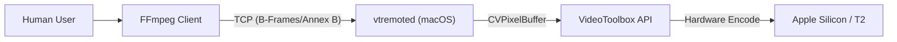

# Architecture

**Updated:** 2026-05-11

## System Context

VideoToolbox Remote bridges a standard FFmpeg client to a dedicated macOS compression server.

## 1. Components

### Client (FFmpeg)
- **Encoders**: `h264_videotoolbox_remote`, `hevc_videotoolbox_remote`
- **Bitstream Filter**: `vtremote_transcode` (packet-in/out transcode mode)
- **Responsibilities**: Demuxing, filtering, audio/subtitles, TCP session lifecycle, rate-control policy.

### Server (`vtremoted`, macOS)
- **Daemon**: Listens on TCP 5555.
- **Session**: Manages one `VTCompressionSession` or `VTDecompressionSession` per connection.
- **Pipeline**:
    1.  Receives negotiated software planes or VideoToolbox-backed hardware-frame uploads.
    2.  Wraps in `CVPixelBuffer`.
    3.  Encodes via Hardware.
    4.  Converts output NALs to **Annex B**.
    5.  Returns packets with PTS/DTS.

### Linux VA-API driver

- **Profiles**: H.264 Baseline/Main/High and HEVC Main/Main 10 encode.
- **Responsibilities**: Accept software-uploaded NV12/P010 VA surfaces, map
  libva encoder parameters to protocol v1, compress planes, convert returned
  codec configuration to Annex-B parameter sets, and publish remote access
  units as independently decodable VA coded buffers.
- **Boundary**: No VA-API decode, video processing, or external surfaces.

## 2. Data Flow (Encode)

1.  **Handshake**: Message `HELLO` exchange.
2.  **Config**: Client sends `CONFIGURE`, Server creates `VTCompressionSession`.
3.  **Stream**:
    - **In**: `FRAME` (pixels, optional side data)
    - **Out**: `PACKET` (H.264/HEVC, optional side data)
4.  **Teardown**: Client sends `FLUSH`, then closes.

## 3. Data Flow (Decode)

1.  **Handshake**: Message `HELLO` exchange.
2.  **Config**: Client sends `CONFIGURE`, Server creates `VTDecompressionSession`.
3.  **Stream**:
    - **In**: `PACKET` (Annex B, optional side data)
    - **Out**: `FRAME` (software planes or negotiated VideoToolbox output)
4.  **Teardown**: Client sends `FLUSH`, then closes.

## 4. Data Flow (Transcode)

1.  **Handshake**: Message `HELLO` exchange.
2.  **Config**: Client sends `CONFIGURE` with `mode=transcode`.
3.  **Stream**:
    - **In**: `PACKET` (Annex B, optional side data)
    - **Out**: `PACKET` (Annex B, optional side data)
4.  **Teardown**: Client sends `FLUSH`, then closes.

## 5. Capability-Gated Media Surfaces

The protocol advertises optional capabilities so newer clients can keep working
with older servers for the original software-frame paths while failing newer
requests during configure. The negotiated 0.4.1 surfaces include:
- VideoToolbox hardware-frame ingest for remote encode and transcode inputs.
- Optional decoder hardware-frame output for callers that request it.
- HEVC input formats beyond NV12/P010, including `bgra`, `ayuv`, and `p210le`.
- Typed frame and packet side-data records used for HDR/colorimetry, display,
  caption, timing, and mux-facing metadata.

Hardware-frame ingest across a network is represented as an explicit upload path:
local VideoToolbox frames are mapped into the negotiated wire pixel format before
the server creates its own `CVPixelBuffer`. Handles such as IOSurface or
CVPixelBuffer references are not treated as cross-host zero-copy objects.

## 6. Repository Layout

- **`ffmpeg/`**: Forked codebase with `libavcodec/vtremote*`.
- **`vtremoted/`**: SwiftPM server implementation.
- **`vaapi-driver/`**: Encode-only Linux VA-API driver and experimental C SDK.
- **`tests/`**: Integration tests and Python mock server.
- **`docs/`**: Protocol and Architecture documentation.

## 7. Performance Defaults

Defaults applied when the client does not override settings:

| Property | Default | Purpose |
|----------|---------|---------|
| `ExpectedFrameRate` | from client | Helps VT optimize encode pipeline |
| `PrioritizeEncodingSpeedOverQuality` | unset | Uses VideoToolbox default unless explicitly set |
| `RealTime` | `false` | Maximize throughput over latency |
| `MaximizePowerEfficiency` | `false` | Maximize speed over power |
| `MaxFrameDelayCount` | from `-bf` | Enable/limit frame reordering |

> [!NOTE]
> Remote decode defaults to **async** with a reorder depth of **2**. The reorder buffer sorts by PTS and clamps only when PTS would regress.
