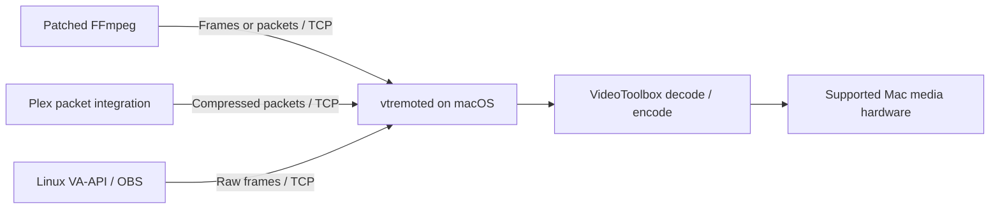

# Architecture

**Updated:** 2026-10-03 · {{ site.current_release }}

## System Context

VideoToolbox Remote connects FFmpeg, stock Linux VA-API applications, a Plex packet integration and an experimental OBS plugin to a macOS VideoToolbox daemon. Client-side files, audio, subtitles and delivery stay local; supported video work runs on the Mac.

```mermaid
flowchart LR
    Client["Patched FFmpeg"] -->|"Frames or packets / TCP"| Server["vtremoted on macOS"]
    Plex["Plex packet integration"] -->|"Compressed packets / TCP"| Server
    VA["Linux VA-API / OBS"] -->|"Raw frames / TCP"| Server
    Server --> VT["VideoToolbox decode / encode"]
    VT --> HW["Supported Mac media hardware"]
```

## 1. Components

### Client (FFmpeg)
- **Encoders**: `h264_videotoolbox_remote`, `hevc_videotoolbox_remote`
- **Bitstream Filter**: `vtremote_transcode` (packet-in/out transcode mode)
- **Decoders**: matching H.264/HEVC remote decoder implementations.
- **Responsibilities**: Demuxing, filtering, audio/subtitles, TCP session lifecycle, rate-control policy.

### Server (`vtremoted`, macOS)
- **Daemon**: Defaults to loopback TCP 5555 with a four-session limit; a reachable listen address is explicit.
- **Session**: Owns compression, decompression, or a decode/resize/encode pipeline per connection.
- **Pipeline**:
    1.  Receives negotiated software planes or VideoToolbox-backed hardware-frame uploads.
    2.  Wraps in `CVPixelBuffer`.
    3.  Encodes via Hardware.
    4.  Converts output NALs to **Annex B**.
    5.  Returns packets with PTS/DTS.

### Linux VA-API driver

- **Profiles**: H.264 Baseline/Main/High and HEVC Main/Main 10 encode.
- **Responsibilities**: Accept software-uploaded NV12/P010 VA surfaces, map
  libva encoder parameters to protocol v1, compress planes, convert returned
  codec configuration to Annex-B parameter sets, and publish remote access
  units as independently decodable VA coded buffers.
- **Boundary**: No VA-API decode, video processing, or external surfaces.

### Plex packet integration

- **Input/output**: Compressed H.264/HEVC packets; the Mac handles decode, optional resize and encode.
- **Boundary**: Separate from the VA-API driver, with no Linux render node. A wrapper checks Plex's codec library and command graph before injecting `vtremote_transcode`; unsupported commands stay native.
- **Guide**: [Plex on a GPU-less Linux host](plex.html).

### OBS plugin (experimental)

- **Input/output**: Raw scene frames and returned H.264/HEVC packets.
- **Selection**: Separate H.264 and HEVC encoder entries, capability-negotiated with the daemon.
- **Boundary**: OBS composition and streaming/muxing remain local. See [OBS setup and validation scope](obs-plugin.html).

## 2. Data Flow (Encode)

1.  **Handshake**: Message `HELLO` exchange.
2.  **Config**: Client sends `CONFIGURE`, Server creates `VTCompressionSession`.
3.  **Stream**:
    - **In**: `FRAME` (pixels, optional side data)
    - **Out**: `PACKET` (H.264/HEVC, optional side data)
4.  **Completion**: Client sends `FLUSH`, receives delayed output until `DONE`, then closes. A timeout or fatal error is not successful completion.

## 3. Data Flow (Decode)

1.  **Handshake**: Message `HELLO` exchange.
2.  **Config**: Client sends `CONFIGURE`, Server creates `VTDecompressionSession`.
3.  **Stream**:
    - **In**: `PACKET` (Annex B, optional side data)
    - **Out**: `FRAME` (software planes or negotiated VideoToolbox output)
4.  **Completion**: Client sends `FLUSH` and receives delayed frames until `DONE` before closing.

## 4. Data Flow (Transcode)

1.  **Handshake**: Message `HELLO` exchange.
2.  **Config**: Client sends `CONFIGURE` with `mode=transcode`.
3.  **Stream**:
    - **In**: `PACKET` (Annex B, optional side data)
    - **Out**: `PACKET` (Annex B, optional side data)
4.  **Completion**: Client sends `FLUSH` and receives delayed packets until `DONE` before closing.

## 5. Capability-Gated Media Surfaces

The protocol advertises optional capabilities so newer clients can keep working
with older servers for the original software-frame paths while failing newer
requests during configure. Capability-gated surfaces include:
- VideoToolbox hardware-frame ingest for remote encode and transcode inputs.
- Optional decoder hardware-frame output for callers that request it.
- HEVC input formats beyond NV12/P010, including `bgra`, `ayuv`, and `p210le`.
- Typed frame and packet side-data records used for HDR/colorimetry, display,
  caption, timing, and mux-facing metadata.

Hardware-frame ingest across a network is represented as an explicit upload path:
local VideoToolbox frames are mapped into the negotiated wire pixel format before
the server creates its own `CVPixelBuffer`. Handles such as IOSurface or
CVPixelBuffer references are not treated as cross-host zero-copy objects.

## 6. Repository Layout

- **`ffmpeg/`**: Forked codebase with `libavcodec/vtremote*`.
- **`vtremoted/`**: SwiftPM server implementation.
- **`vaapi-driver/`**: Encode-only Linux VA-API driver and experimental C SDK.
- **`vaapi-driver/docker/` and `scripts/`**: Plex image, wrapper, preload filter and playback checks.
- **`obs-plugin/`**: Experimental remote OBS encoders.
- **`tests/`**: Integration tests and Python mock server.
- **`docs/`**: Protocol and Architecture documentation.

## 7. Performance Defaults

Defaults applied when the client does not override settings:

| Property | Default | Purpose |
|----------|---------|---------|
| `ExpectedFrameRate` | from client | Helps VT optimize encode pipeline |
| `PrioritizeEncodingSpeedOverQuality` | unset | Uses VideoToolbox default unless explicitly set |
| `RealTime` | `false` | Maximize throughput over latency |
| `MaximizePowerEfficiency` | `false` | Maximize speed over power |
| `MaxFrameDelayCount` | from `-bf` | Enable/limit frame reordering |

> [!NOTE]
> Remote decode defaults to **async** with a reorder depth of **2**. The reorder buffer sorts by PTS and clamps only when PTS would regress.
