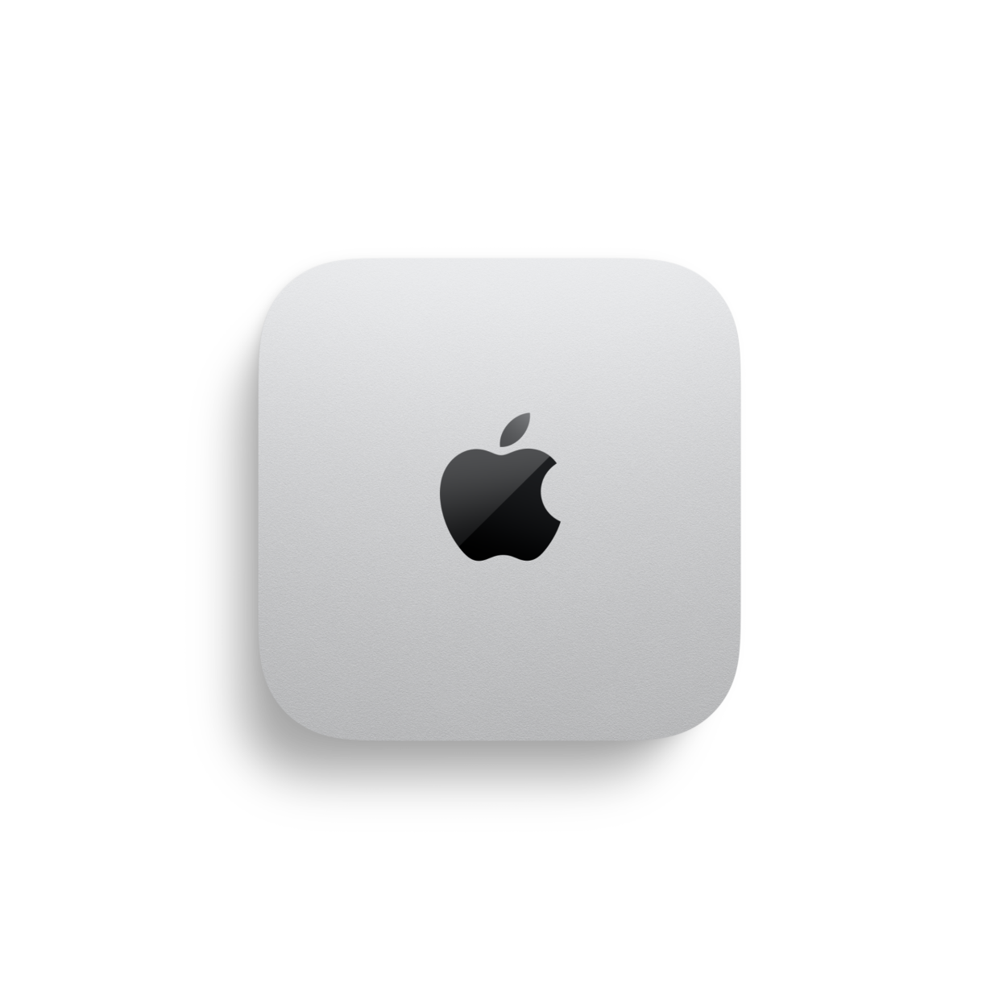
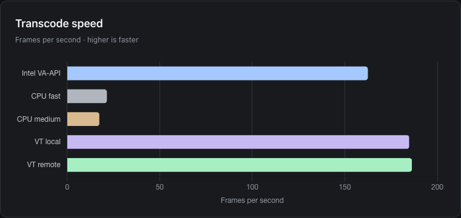

<section class="hero" aria-labelledby="hero-title">
  

    <h1 id="hero-title">Let your Mac handle the transcodes.</h1>
    
High-quality, low-power transcoding over LAN. Keep Plex, your files and your workflows where they are.

    

      <a class="button primary" href="getting-started.html">Get started</a>
      <a class="button" href="{{ site.latest_release_url }}">Download {{ site.current_release }} ↗</a>
    

    
Open source · H.264 &amp; HEVC · 10-bit HEVC support

  

  <figure class="mac-visual">
    

  </figure>
</section>

<section class="landing-section" aria-labelledby="workflows-title">
  <h2 id="workflows-title">An encoder for the tools you already use.</h2>
  

    

      
Linux x86_64

      <h3>Stream from a GPU-less server.</h3>
      
Keep Plex on Linux or your NAS. The Mac handles supported video decode, resize and encode; your server delivers playback. No Linux GPU required.

      <a class="text-link" href="plex.html">Set up Plex offload →</a>
      
Plex Pass and a supported Plex build required.

    

    

      
FFmpegLinux · Windows · macOS

      <h3>Work through your batch queue.</h3>
      
Convert H.264 or HEVC files using the Mac's efficient media engine. Packet transcoding sends compressed video both ways, keeping network traffic low.

      <a class="text-link" href="getting-started.html#packet-transcoding-for-batch-jobs">Run a batch transcode →</a>
      
Use the matching FFmpeg client release.

    

    

      
OBS StudioExperimental

      <h3>Offload your live encoder.</h3>
      
Compose scenes on your OBS machine and send frames to the Mac for H.264 or HEVC encoding. Recording, audio and stream delivery stay in OBS.

      <a class="text-link" href="obs-plugin.html">Try the OBS plugin →</a>
      
Build from source and test your streaming setup.

    

    

      
VA-APILinux x86_64

      <h3>Keep your existing FFmpeg.</h3>
      
Use stock FFmpeg's <code>h264_vaapi</code> or <code>hevc_vaapi</code> encoders with VideoToolbox on the Mac. Decode and filters run on Linux.

      <a class="text-link" href="vaapi-driver.html">Install the VA-API driver →</a>
      
Encode-only. Libva requires a DRM render node.

    

  

</section>

<section class="landing-section performance-preview" aria-labelledby="performance-title">
  

    <h2 id="performance-title">See the speed. Check the quality.</h2>
    
Compare Intel iGPU VA-API, CPU fast and medium presets, and local and remote VideoToolbox. Explore throughput, VMAF and physical file size at the same bitrate budget.

    <a class="text-link" href="performance.html">Explore the interactive benchmarks →</a>
    
Big Buck Bunny and FFmpeg test signals. Whole-system power has not been measured; see <a href="performance.html#power-and-quality">power and quality guidance</a>.

  

  <figure class="performance-shot">
    
    <figcaption>Big Buck Bunny · HEVC · 1080p · 4 Mb/s budget Measured 2026-10-04 · v0.9.14 · median of three runs</figcaption>
  </figure>
</section>

<section class="landing-section quickstart" aria-labelledby="setup-title">
  

    <h2 id="setup-title">Connect once. Start encoding.</h2>
    
Install the server on your Mac and the matching client on the machine running your jobs. Set the Mac endpoint, then try a short transcode.

    
<a class="button primary" href="getting-started.html">Installation guide →</a><a class="text-link" href="security.html">Secure your connection →</a>

    
13+ · Apple Silicon or supported Intel Mac Wired LAN recommended

  

  

    
FFmpeg · remote HEVC encode

    <pre><code>ffmpeg -i input.mkv \
  -c:v hevc_videotoolbox_remote \
  -vt_remote_host "${MAC_HOST}:5555" \
  -b:v 4M -c:a copy \
  output.mkv</code></pre>
    
Set <code>MAC_HOST</code> to your Mac's LAN address. This encode keeps decoding on the client.

  

</section>

Mac mini image © Apple · <a href="https://www.apple.com/mac-mini/">Image source</a>

