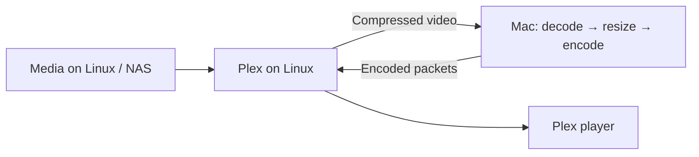

# Plex on a GPU-less Linux host

Keep Plex Media Server on your Linux homelab server or NAS. Use a Mac mini, MacBook or another supported Mac as the external VideoToolbox engine for high-quality, efficient video transcodes.

The supported container path sends compressed H.264/HEVC video packets to `vtremoted`. The Mac decodes, optionally resizes, then encodes H.264 or HEVC. Plex on Linux keeps media storage, demuxing, audio/subtitle processing, muxing and playback delivery. The remote video path needs no Linux GPU, VA-API driver or DRM render node.



## Requirements and compatibility

- Linux x86_64 Docker host. This image does not provide an arm64 Plex integration.
- A [Mac daemon](getting-started.html#install-the-release-binaries) reachable from the container, with the requested VideoToolbox codec support.
- An existing Plex configuration or a new server configured using the official image's normal claim and storage settings.
- Plex Pass for normal hardware-accelerated playback, with **Use hardware acceleration when available** and **Use hardware-accelerated video encoding** enabled under Settings → Server → Transcoder. See [Plex's requirements](https://support.plex.tv/articles/115002178853-using-hardware-accelerated-streaming/).

The integration uses a narrow Plex Transcoder wrapper and an injected packet filter. Container startup checks Plex's bundled `libavcodec` fingerprint against an explicit allowlist. Each invocation also checks the full runtime codec version before rewriting a command. Plex Media Server **1.43.3.10896** has unclaimed-server end-to-end test coverage; the wrapper also recognizes the SDR VA-API graph emitted by **1.43.4**. Recognition of a graph is not full validation of every playback path in that Plex release.

An unrecognized library build or command stays on Plex's native path. Upgrading Plex can therefore disable remote offload until the new library is validated. The Dockerfile pins the official amd64 bootstrap image digest, but the upstream init process downloads the selected PMS version at startup; that digest alone does not pin the runtime PMS build.

## Build the Plex image

From the repository root:

```bash
docker build -f vaapi-driver/docker/Dockerfile.plex \
  --build-arg VTREMOTE_VERSION="$(git describe --tags --always)" \
  -t plex-vtremote .
```

Use the built image with your existing official-image Plex configuration. Preserve your `/config` volume, media mounts, networking and claim settings. A minimal service shape is:

```yaml
services:
  plex:
    image: plex-vtremote
    container_name: plex
    network_mode: host
    environment:
      VTREMOTE_HOST: "192.168.1.20:5555"
      VTREMOTE_TOKEN: "${VTREMOTE_TOKEN:-}"
      VTREMOTE_PLEX_REMOTE_TRANSCODE: "1"
      VTREMOTE_TIMEOUT_MS: "10000"
      VTREMOTE_LOG: "1"
    volumes:
      - /path/to/plex-config:/config
      - /path/to/media:/media:ro
      - /path/to/transcode:/transcode
```

Replace the paths and Mac address with your deployment values before starting the container. This example uses Linux host networking; retain an appropriate network configuration for your existing server. There is no `/dev/dri` mapping for the remote packet path.

The repository also supplies a [Compose merge fragment]({{ site.repository_url }}/blob/main/vaapi-driver/docker/docker-compose.plex.yml.example) that builds the image and sets the remote environment. It is a fragment to merge into an existing Plex service, not a complete storage/network configuration. Its build context is relative to the example's location; adjust it if you move the file.

Use `VTREMOTE_TOKEN` when the daemon requires a token. Keep the endpoint on a trusted network or encrypted tunnel; [tokens do not encrypt traffic](security.html).

## Which transcodes are offloaded?

| Plex video path | Behavior |
| --- | --- |
| H.264/HEVC input with recognized software scale / format / hardware upload graph | Remote decode, resize and encode |
| Recognized SDR VA-API upload / scale / upload graph | Remote decode, resize and encode |
| Direct Play / Direct Stream without a video transcode | No remote video job needed |
| Unsupported codecs, unknown graphs or unrecognized codec-library builds | Original native Plex command |
| Tone mapping, deinterlace, subtitle burn-in or multiple video input/output paths | Native processing; not offloaded by this integration |
| Audio transcode, subtitles and container delivery | Linux/Plex responsibility |

Supported commands translate bitrate, maximum rate, VBV window, GOP/B-frame settings, profile, H.264 level, entropy mode and CBR/VBR/CQP selection. Plex's periodic `force_key_frames` expression becomes an interval and closed-GOP request using the requested output frame rate. A fixed HEVC level, unsupported values or indirect filter labels keep the original command intact.

On a GPU-less Linux host, native processing may use substantial CPU. Hardware on another host does not automatically cover an unsupported Plex path. Any local hardware used for native transcoding must be exposed separately.

## Verify the bundled Transcoder first

With the container named `plex` running and the Mac daemon reachable, run from the checkout:

```bash
PLEX_CONTAINER=plex \
  ./vaapi-driver/scripts/plex-transcoder-remote-smoke.sh
```

This requires host `ffmpeg` and `ffprobe`, but no Plex token, media library or Plex Pass. It exercises the actual bundled Transcoder, injected filter, network and Mac video engine. Cases cover H.264 encode, HEVC Main 10 decode to H.264, and HEVC encode. Each case checks 96 output frames across at least three independently decodable, keyframe-aligned segments with the requested dimensions and profile.

This check validates the Transcoder integration. A real Plex playback decision needs the next check.

## Verify a real Plex playback request

After claiming the server and enabling the Plex Pass hardware settings, choose an SDR H.264/HEVC library item that needs resize and encode without subtitle burn-in, tone mapping or deinterlace:

```bash
PLEX_URL=http://127.0.0.1:32400 \
PLEX_TOKEN=YOUR_PLEX_TOKEN \
PLEX_RATING_KEY=12345 \
PLEX_CONTAINER=plex \
  ./vaapi-driver/scripts/plex-playback-smoke.sh
```

Replace the rating key with your library item's key. The script requests an HLS transcode using Plex's Chrome profile, downloads and decodes a segment, requires a fresh remote-handshake audit marker, and stops its own playback session. It expects H.264 output for this profile.

A successful handshake alone proves the remote path started. A fresh marker **and a decodable returned segment** prove media came back through that path. Check Linux CPU and server logs separately for performance; a Plex dashboard hardware label alone is not that evidence.

## Audit and troubleshoot

The default successful-handshake audit file is `/dev/shm/plex/vtremote-plex-wrapper.log`, configurable with `VTREMOTE_PLEX_AUDIT_FILE`. Look for `remote-decode-scale-encode`. Wrapper decisions are recorded in the corresponding `.decision` file, including reasons for native processing.

If the marker is absent, inspect startup logs for the library gate, the actual input codec, selected Plex filter graph and unsupported encoder constraints. If it is present but playback fails, keep both Plex Transcoder and `vtremoted` logs and verify returned segments with the smoke scripts. Linux CPU can still be used by audio, subtitles, I/O and native video paths.

See [troubleshooting](troubleshooting.html#plex-transcode-still-uses-substantial-linux-cpu), the [integration reference]({{ site.repository_url }}/blob/main/vaapi-driver/docs/PLEX.md), and [quality & benchmarks](benchmarks.html). The published packet benchmarks cover controlled video jobs, not a guaranteed number of simultaneous Plex streams.
