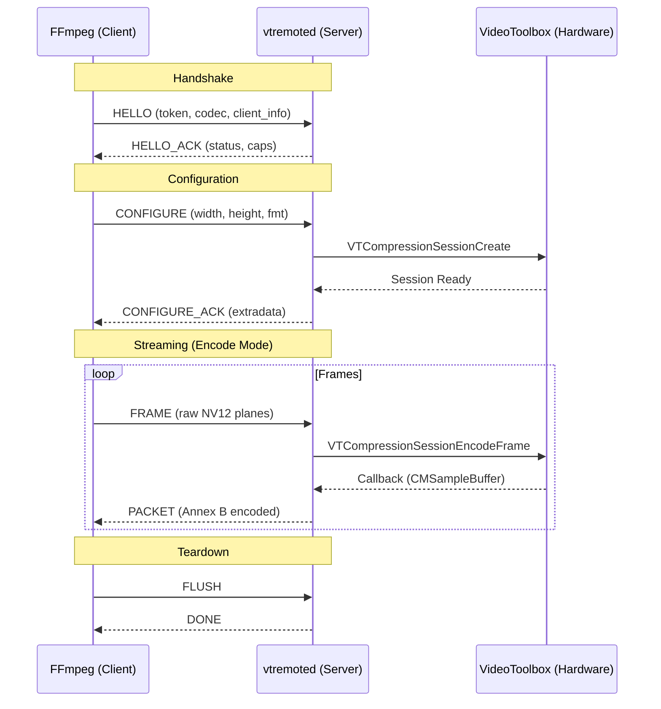

# VideoToolbox Remote Protocol

**Status:** Stable v1.
**Wire Format:** Annex B (mandatory).
**Endianness:** Big Endian (Network Byte Order).

## 1. Overview
The protocol uses a single TCP connection per encode/decode session. It is stateful, starting with a handshake (`HELLO`), configuration (`CONFIGURE`), and then a stream of frames/packets.

### Sequence Flow

## 2. Transport & Framing
*   **Port**: Default `5555`.
*   **Framing**: All messages share a common 12-byte header.

### Header Structure

| Offset | Type | Name | Value / Description |
| :--- | :--- | :--- | :--- |
| 0 | `uint32` | `magic` | `0x56545231` ("VTR1") |
| 4 | `uint16` | `version` | `1` |
| 6 | `uint16` | `type` | Enum ID (see below) |
| 8 | `uint32` | `length` | Payload size in bytes (excluding header) |

## 3. Message Types

| ID | Name | Direction | Payload Description |
| :--- | :--- | :--- | :--- |
| `1` | **HELLO** | C → S | Initial handshake with auth token. |
| `2` | **HELLO_ACK** | S → C | Server acceptance/rejection. |
| `3` | **CONFIGURE** | C → S | Stream parameters. |
| `4` | **CONFIGURE_ACK** | S → C | Finalized config & codec extradata. |
| `5` | **FRAME** | Bidirectional | Raw image data (planes). |
| `6` | **PACKET** | Bidirectional | Encoded bitstream (Annex B). |
| `7` | **FLUSH** | C → S | Request to drain pipeline. |
| `8` | **DONE** | S → C | Pipeline drained signal. |
| `9` | **ERROR** | Bidirectional | Fatal error info. |
| `10` | **PING** | Bidirectional | Keepalive. |
| `11` | **PONG** | Bidirectional | Keepalive response. |

## 4. Payloads

### HELLO (Type 1)

| Type | Name | Description |
| :--- | :--- | :--- |
| `string` | `token` | Auth token (optional). |
| `string` | `codec` | Requested codec (e.g., `h264`, `hevc`). |
| `string` | `client_name` | User-agent string. |
| `uint32` | `build_id` | Client build version. |

### HELLO_ACK (Type 2)

| Type | Name | Description |
| :--- | :--- | :--- |
| `uint32` | `status` | `0=OK`, `1=Busy`, `2=AuthFail`. |
| `string` | `server_name` | Server ID string. |
| `uint32` | `server_version` | Server build version. |
| `uint32` | `max_sessions` | Concurrency limit. |

### CONFIGURE (Type 3)

| Type | Name | Description |
| :--- | :--- | :--- |
| `uint32` | `width` | Video width. |
| `uint32` | `height` | Video height. |
| `uint32` | `pix_fmt` | `1=NV12`, `2=P010`. |
| `uint32` | `time_base_num` | Timebase numerator. |
| `uint32` | `time_base_den` | Timebase denominator. |
| `map` | `options` | Key-value pairs (e.g., `bitrate`). |
| `bytes` | `extradata` | Header data (decoding only). |

### FRAME (Type 5)
Used for **sending raw frames** (Encode) or **receiving raw frames** (Decode).

| Type | Name | Description |
| :--- | :--- | :--- |
| `int64` | `pts` | Presentation timestamp. |
| `int64` | `duration` | Frame duration. |
| `uint32` | `flags` | `Bit 0`: Force Keyframe. |
| `planes[]` | `planes` | NV12/P010 Plane data. |

**Plane Data Format**:
`count` (uint8) followed by: `stride` (u32), `height` (u32), `length` (u32), `bytes`.

### PACKET (Type 6)
Used for **receiving encoded data** (Encode) or **sending encoded data** (Decode).

| Type | Name | Description |
| :--- | :--- | :--- |
| `int64` | `pts` | Presentation timestamp. |
| `int64` | `dts` | Decoding timestamp. |
| `int64` | `duration` | Packet duration. |
| `uint32` | `flags` | `Bit 0`: Is Keyframe. |
| `bytes` | `data` | **Annex B** NAL units. |

## 5. Security & Error Handling
*   **Authentication**: Simple token matching in `HELLO`.
*   **Timeouts**: 10s read timeout suggested. Send `PING` every 5s if idle.
*   **Errors**: Connection is closed immediately after sending an `ERROR` message.

### Error Codes

| Code | Meaning |
| :--- | :--- |
| `1` | Auth Failure |
| `2` | Server Busy (Max Sessions) |
| `3` | Unsupported Configuration |
| `4` | Bad Request (Protocol Violation) |
| `5` | Internal Server Error |
