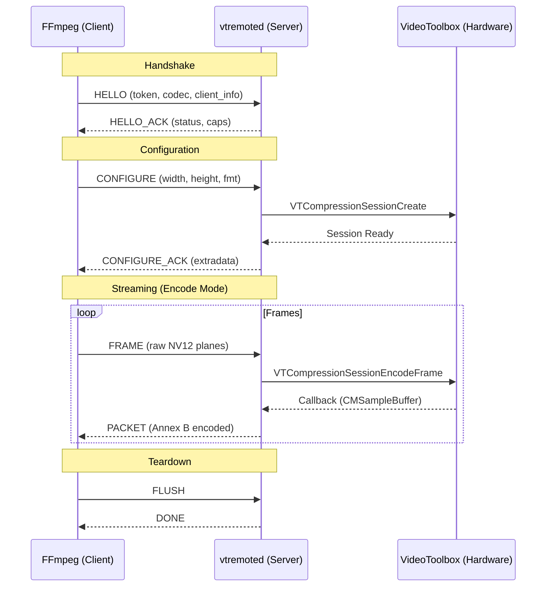

# VideoToolbox Remote Protocol

**Status**: Stable v1
**Wire Format**: Annex B (mandatory)
**Endianness**: Big Endian (Network Byte Order)

## 1. Overview

The protocol uses a single TCP connection per session. It is stateful, starting with a handshake (`HELLO`), configuration (`CONFIGURE`), and then a stream of frames/packets.

### Communication Modes

| Mode | Input | Output | Description |
|---|---|---|---|
| **Encode** | `FRAME` | `PACKET` | Raw frames in, compressed NALs out. |
| **Decode** | `PACKET` | `FRAME` | Compressed NALs in, raw frames out. |
| **Transcode** | `PACKET` | `PACKET` | Compressed NALs in, compressed NALs out. |

### Sequence Flow (Encode)

```mermaid
sequenceDiagram
    participant C as FFmpeg (Client)
    participant S as vtremoted (Server)
    participant VT as VideoToolbox (Hardware)

    Note over C,S: Handshake
    C->>S: HELLO (token, codec, client_info)
    S-->>C: HELLO_ACK (status, caps)

    Note over C,S: Configuration
    C->>S: CONFIGURE (width, height, fmt)
    S->>VT: VTCompressionSessionCreate
    VT-->>S: Session Ready
    S-->>C: CONFIGURE_ACK (extradata)

    Note over C,S: Streaming (Encode Mode)
    loop Frames
        C->>S: FRAME (raw NV12 planes)
        S->>VT: VTCompressionSessionEncodeFrame
        VT-->>S: Callback (CMSampleBuffer)
        S-->>C: PACKET (Annex B encoded)
    end

    Note over C,S: Teardown
    C->>S: FLUSH
    S-->>C: DONE
```

## 2. Transport & Framing

- **Port**: Default `5555`.
- **Framing**: All messages share a common 12-byte header.

### Header Structure

| Offset | Type | Name | Value |
| :--- | :--- | :--- | :--- |
| 0 | `uint32` | `magic` | `0x56545231` ("VTR1") |
| 4 | `uint16` | `version` | `1` |
| 6 | `uint16` | `type` | Enum ID (see below) |
| 8 | `uint32` | `length` | Payload size in bytes (excluding header) |

## 3. Message Types

| ID | Name | Direction | Payload Description |
| :--- | :--- | :--- | :--- |
| `1` | **HELLO** | C → S | Initial handshake with auth token. |
| `2` | **HELLO_ACK** | S → C | Server acceptance/rejection. |
| `3` | **CONFIGURE** | C → S | Stream parameters. |
| `4` | **CONFIGURE_ACK** | S → C | Finalized config & codec extradata. |
| `5` | **FRAME** | Bidirectional | Raw image data (planes). |
| `6` | **PACKET** | Bidirectional | Encoded bitstream (Annex B). |
| `7` | **FLUSH** | C → S | Request to drain pipeline. |
| `8` | **DONE** | S → C | Pipeline drained signal. |
| `9` | **ERROR** | Bidirectional | Fatal error info. |
| `10` | **PING** | Bidirectional | Keepalive. |
| `11` | **PONG** | Bidirectional | Keepalive response. |

## 4. Message Payloads

### Handshake

**HELLO (Type 1)**
- `token` (string): Auth token (optional).
- `codec` (string): Requested codec (e.g., `h264`, `hevc`).
- `client_name` (string): User-agent string.
- `build` (string): Client build/version string (freeform).

**HELLO_ACK (Type 2)**
- `status` (uint8): `0=OK`, `1=Busy`, `2=AuthFail`.
- `server_name` (string): Server ID.
- `server_version` (string): Server version string (freeform).
- `caps` (string[]): Capability strings (may be empty).
  - Common values: `h264`, `hevc`, `pixfmt.nv12`, `pixfmt.p010`, `pixfmt.bgra`,
    `pixfmt.ayuv`, `pixfmt.p210`, `hwframes.videotoolbox.input`,
    `hwframes.videotoolbox.output`, `side_data.v2`.
- `max_sessions` (uint16): Concurrency limit.
- `active_sessions` (uint16): Current active sessions.

### Configuration

**CONFIGURE (Type 3)**
- `width`, `height` (uint32): Video dimensions.
- `pix_fmt` (uint8): `1=NV12`, `2=P010`, `3=BGRA`, `4=AYUV`, `5=P210`, `6=VideoToolbox`.
- `options` (map): Key-value pairs (bitrate, GOP, etc.).
- `extradata` (bytes): Header data (decoding only).

> [!NOTE]
> `options` is a map of codec settings. Unknown keys are ignored.
> For `mode=transcode`, `out_codec`, `out_width`, `out_height`, and `scale_mode` are passed here.

### Streaming

**FRAME (Type 5)**
Raw frame planes.
- `pts`, `duration` (int64).
- `flags` (uint32): Bit 0 = Keyframe request/indicator.
- `plane_count` (uint8): Number of following planes.
- `planes` (struct[]): Stride, height, byte length, data.
- Optional side data: `side_data_count` followed by `(type, size, data)` records.

**PACKET (Type 6)**
Encoded Annex B NAL units.
- `pts`, `dts`, `duration` (int64).
- `flags` (uint32): Bit 0 = Keyframe.
- `data` (bytes): NAL units.

## 5. Security & Error Handling

- **Authentication**: Simple token matching in `HELLO`.
- **Timeouts**: 10s read timeout suggested. Send `PING` every 5s if idle.
- **Errors**: Connection closes immediately after sending `ERROR`.

### Error Codes

| Code | Meaning |
| :--- | :--- |
| `1` | Auth Failure |
| `2` | Server Busy |
| `3` | Unsupported Config |
| `4` | Bad Request |
| `5` | Internal Error |
